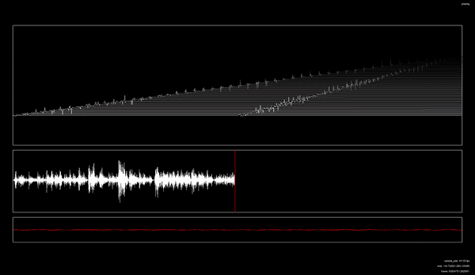
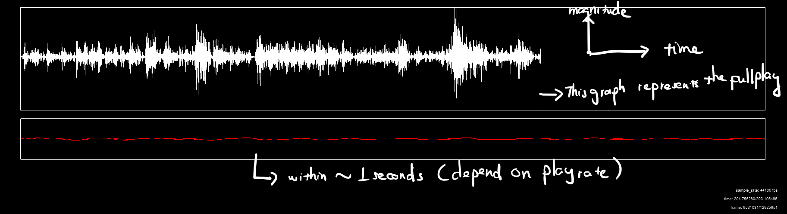
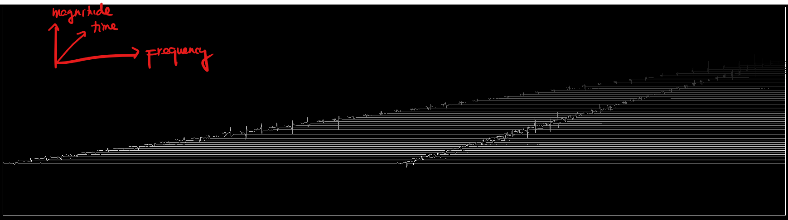

# Visual Music

Visual Music is a project to visualize music.

_This is my final project for UIUC's CS126 - Software Design Studio._

**Click the GIF below to view the full demo on YouTube**

[](https://youtu.be/Y2Iu3SFMiGg)

## Background
I'm interested in how we can visualize pieces of music while reflecting the play's emotions.

This project attempt some basic visualization for audio files. It would be a basis for more complicated visualization of audio.

## Setup
The program is writen in C++ and is based on Cinder Framework. In order to run it in your local machine, you machine needs to meet the following requirement.

**Requirement:**
* Visual Studio 2015
* CMake
* Cinder Framework

After installing Cinder, put the project under ~/Cinder/my-projects

In order to run this project, you will need to create a new folder name /asset, and then put your audio files inside this folder.
Supported audio files: https://docs.microsoft.com/en-us/windows/win32/medfound/supported-media-formats-in-media-foundation?redirectedfrom=MSDN

Possible helpful resources:
- https://libcinder.org/docs/guides/audio/index.html#read_audio
- https://libcinder.org/docs/namespacecinder_1_1audio.html
## Structure
``` text
.
├── CMakeLists.txt
├── .clang-format
├── .clang-tidy
├── .gitignore
├── app
│   └── cinder_app_main.cc
├── include
│   ├── music_visual_app.h
│   └── audio_visualizer.h
├── src
│   ├── music_visual_app.cc
│   └── audio_visualizer.cc
└── tests
    ├── test_main.cc
    └── test_audio_visualizer.cc
```

## Functionality

You can press Space

This app provides 2 main kinds of audio graphing:
- **Magnitude - Time:**
  
- **Magnitude - Frequency - Time:**
  

## Future Work
For future work, I would work on user interface and find better ways to represent audio data in 3D.